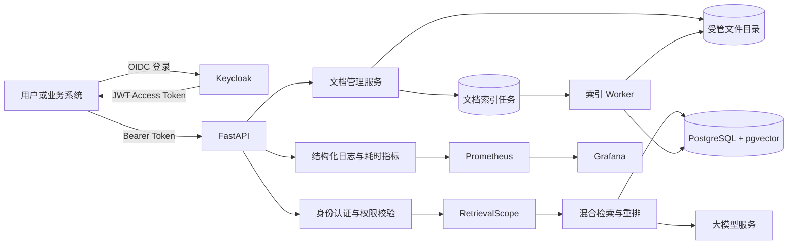

# Multi-tenant Long-context RAG Engine

[](https://github.com/Heresy0/Multi-tenant-long-context-rag-engine/actions/workflows/ci.yml)

面向企业内部知识库的多租户 RAG 问答系统。项目使用 Keycloak 完成 OIDC 身份认证，在 PostgreSQL 中维护租户、部门、用户、知识库和授权关系，并通过 pgvector 实现带强制权限范围的向量检索。

系统已经覆盖文档上传、幂等索引、混合检索、重排、答案生成、引用校验、结构化观测日志和离线评估等核心链路，重点解决企业知识库中“用户是谁、能够查询哪些资料、回答依据来自哪里”的问题。

## 核心能力

- Keycloak OIDC 登录、JWT 签名及 issuer、audience 校验
- 租户、部门、用户和知识库四层权限模型
- 用户授权与部门授权，支持 `viewer`、`editor` 和 `admin` 权限
- 不可变 `RetrievalScope`，检索时强制携带 `tenant_id` 和 `knowledge_base_id`
- PostgreSQL 16、pgvector 0.8.6 和余弦距离 HNSW 索引
- PDF、DOCX、TXT、Markdown 文档解析、切分和 1024 维向量入库
- 文件内容未变化时跳过重复入库，更新失败时保留旧版本
- 向量检索、BM25 关键词检索、融合和重排
- 可回答性判断、资料引用和拒答机制
- 文档列表、上传、更新及删除 API
- 问答阶段耗时、请求 ID 和权限拒绝事件等结构化日志
- Worker 心跳、索引队列状态和分层健康检查
- Prometheus 指标、告警规则和自动配置的 Grafana 看板
- 开发集、独立测试集和答案级离线评估脚本
- Docker Compose 本地环境及 GitHub Actions 持续集成

## 系统架构



一条问答请求的大致流程为：

1. API 验证 Keycloak JWT，并把外部身份映射为本地租户用户。
2. 授权服务验证用户对目标知识库的访问权限。
3. 系统生成不可变的 `RetrievalScope`。
4. 检索仓储在数据库查询中强制过滤租户和知识库。
5. 系统完成向量与关键词混合检索、结果融合和重排。
6. 大模型根据受控上下文生成答案，系统校验并输出引用。

## 技术栈

| 类别 | 技术 |
| --- | --- |
| Web API | FastAPI、Pydantic、Uvicorn |
| 身份认证 | Keycloak、OIDC、JWT |
| 数据库 | PostgreSQL 16、SQLAlchemy、Alembic |
| 向量检索 | pgvector 0.8.6、HNSW |
| RAG | LangChain、BM25、DashScope Embedding/Rerank/LLM |
| 文档处理 | PyPDF、python-docx、docx2txt |
| 测试 | pytest、真实 PostgreSQL 集成测试 |
| 工程化 | Docker Compose、GitHub Actions |
| 可观测性 | JSON 日志、Prometheus、Grafana |

## 目录结构

```text
.
├── backend/app/              # FastAPI、认证授权、检索和问答服务
│   ├── api/                  # REST API 路由
│   ├── db/                   # ORM 模型、数据库会话及初始化逻辑
│   └── security/             # OIDC、Principal、权限与检索范围
├── migrations/               # Alembic 数据库迁移
├── scripts/                  # 租户初始化、批量入库和评估工具
├── tests/                    # 单元测试、API 测试和集成测试
├── evals/
│   ├── datasets/             # 开发集和独立测试集
│   └── reports/              # 评估报告
├── sample_docs/              # 演示文档
├── monitoring/               # Prometheus、告警与 Grafana 配置
├── compose.yaml              # 应用、依赖服务与监控栈
├── Dockerfile                # API 生产镜像入口
└── requirements.txt
```

## 快速开始

### 1. 环境要求

- Git
- Docker Desktop，支持 Docker Compose
- 可选：Python 3.12，用于不通过容器运行 API 和测试
- 可用的对话、Embedding 和 Rerank 模型服务

### 2. 获取代码

```powershell
git clone https://github.com/Heresy0/Multi-tenant-long-context-rag-engine.git
Set-Location Multi-tenant-long-context-rag-engine
```

### 3. 配置环境变量

```powershell
Copy-Item .env.example .env
```

编辑 `.env`，至少设置以下配置：

- PostgreSQL 数据库名、用户名和密码
- Keycloak 管理员用户名和密码
- OIDC issuer、audience 和 JWKS 地址
- DashScope 对话、Embedding 和 Rerank 模型配置
- DeepSeek 模型配置
- OSS 配置

应用启动时会校验必要环境变量，空值会导致启动失败。不要把包含真实密钥的 `.env` 提交到 Git。

### 4. 启动基础服务

首次运行时，先启动 PostgreSQL 和 Keycloak：

```powershell
docker compose up -d postgres keycloak
docker compose ps
```

访问 Keycloak 管理后台：

- 地址：<http://127.0.0.1:8080>
- 管理员账号：使用 `.env` 中的配置

在 Keycloak 中创建以下开发环境资源：

- Realm：`enterprise-knowledge`
- Client：`enterprise-knowledge-api`
- Client audience：`enterprise-knowledge-api`
- 测试用户，例如 Alice 和 Bob

本地用户通过 Keycloak Token 中的 `sub` 与数据库中的 `external_subject` 关联。

### 5. 启动 API 和索引 Worker

Keycloak Realm 和模型配置准备完成后，构建并启动全部服务：

```powershell
docker compose up --build -d
docker compose ps
```

检查服务：

```powershell
Invoke-RestMethod http://127.0.0.1:8000/health
```

正常响应：

```json
{
  "status": "ok"
}
```

常用地址：

- Swagger API 文档：<http://127.0.0.1:8000/docs>
- OpenAPI JSON：<http://127.0.0.1:8000/openapi.json>
- Keycloak：<http://127.0.0.1:8080>
- Prometheus：<http://127.0.0.1:9090>
- Grafana：<http://127.0.0.1:3000>

查看 API 和索引 Worker 日志：

```powershell
docker compose logs -f api worker
```

健康检查地址：

- `/health/live`：API 进程存活检查
- `/health/ready`：数据库就绪检查
- `/health/indexing`：Worker 心跳与索引队列状态

Worker 默认每 10 秒写入一次心跳，30 秒没有新心跳即视为不可用。
可以通过 `INDEXING_WORKER_HEARTBEAT_SECONDS` 和
`INDEXING_WORKER_STALE_SECONDS` 调整，但失联阈值至少应为心跳间隔的两倍。

### Prometheus 与 Grafana

API 在 `/metrics` 导出 Prometheus 文本指标。指标标签只包含请求路由、
状态和处理结果等低基数字段，不包含租户、用户、问题、文档或任务标识。

Prometheus 每 15 秒抓取一次 API，并加载以下告警：

- 索引 Worker 持续不可用
- 排队任务持续超过十个
- 最近十分钟出现最终失败任务
- QA P95 延迟持续超过十五秒

Grafana 启动时会自动配置 Prometheus 数据源和
`Enterprise Knowledge RAG` 看板。首次启动前应在 `.env` 中修改：

```env
GRAFANA_ADMIN_USER=admin
GRAFANA_ADMIN_PASSWORD=<强密码>
```

常用指标包括：

```text
enterprise_http_requests_total
enterprise_qa_requests_total
enterprise_qa_request_duration_seconds
enterprise_qa_stage_duration_seconds
enterprise_indexing_jobs_total
enterprise_indexing_job_duration_seconds
enterprise_indexing_workers_active
enterprise_indexing_queue_jobs
enterprise_indexing_oldest_queued_seconds
```

API 指标由 `api:8000/metrics` 提供；索引执行计数和耗时由 Worker
内部的 `worker:9101/metrics` 提供。Worker 指标端口只暴露在 Compose
内部网络，不映射到宿主机。

停止服务：

```powershell
docker compose down
```

`docker compose down` 不会删除数据库和文档卷。只有明确需要清空本地数据时，才使用 `docker compose down --volumes`。

## 不使用容器运行 API

PostgreSQL 和 Keycloak 仍可通过 Docker 启动，API 在本机虚拟环境中运行：

```powershell
python -m venv .venv
Set-ExecutionPolicy -Scope Process Bypass
.\.venv\Scripts\Activate.ps1
python -m pip install --upgrade pip
python -m pip install -r requirements-dev.txt
python -m alembic upgrade head
python -m uvicorn backend.app.main:app --reload
```

本机运行时，`.env` 中的数据库和 Keycloak 地址应使用 `127.0.0.1`，而不是 Compose 服务名。

## 初始化租户与权限数据

先从 Keycloak 用户详情或访问令牌的 `sub` 字段取得用户 subject，然后执行初始化脚本。

创建首个租户、部门、管理员和知识库：

```powershell
python scripts/bootstrap_tenant.py `
  --tenant-name "示例企业" `
  --department-name "技术部" `
  --subject "<Alice 的 Keycloak sub>" `
  --user-name "Alice" `
  --user-email "alice@example.com"
```

为已有租户创建另一个部门负责人：

```powershell
python scripts/provision_department_manager.py `
  --tenant-name "示例企业" `
  --department-name "人力资源部" `
  --subject "<Bob 的 Keycloak sub>" `
  --user-name "Bob" `
  --user-email "bob@example.com"
```

脚本会输出租户、用户、部门和知识库 UUID，后续入库与接口验证会使用这些 ID。

如果 API 仅在容器中安装了依赖，也可以把命令改为：

```powershell
docker compose exec api python scripts/bootstrap_tenant.py --help
```

## 文档入库

系统支持 `.pdf`、`.docx`、`.txt` 和 `.md` 文件。

### 通过 API 上传

取得访问令牌后，可以在 Swagger 页面点击 **Authorize**，然后调用：

```text
POST /api/knowledge-bases/{knowledge_base_id}/documents
```

上传操作要求当前用户至少具有目标知识库的 `editor` 权限。
接口完成安全暂存和任务创建后返回 `202 Accepted`，响应中的
`indexing_job.id` 是后续查询索引进度的任务标识。文件在任务成功前
不会覆盖已有的正式版本。

索引任务由独立 Worker 执行。可以使用以下接口查询任务状态：

```text
GET /api/knowledge-bases/{knowledge_base_id}/indexing-jobs/{job_id}
```

任务状态依次为 `queued`、`running`，最终进入 `succeeded` 或
`failed`。临时失败会按照任务的最大尝试次数自动重试。
编辑者还可以查询知识库最近的任务，并按状态或文档过滤：

```text
GET /api/knowledge-bases/{knowledge_base_id}/indexing-jobs
GET /api/knowledge-bases/{knowledge_base_id}/indexing-jobs?status=failed
```

最终失败任务的候选文件默认保留 24 小时。在保留期内排除故障后，
可以通过以下接口把任务重新加入队列：

```text
POST /api/knowledge-bases/{knowledge_base_id}/indexing-jobs/{job_id}/retry
```

保留时间由 `INDEXING_FAILED_FILE_RETENTION_HOURS` 控制。超过保留期的
候选文件会由 Worker 清理，此后需要重新上传原文档。

### 通过命令行写入单个文件

```powershell
python scripts/index_pgvector.py `
  --file "sample_docs/example.docx" `
  --tenant-id "<tenant UUID>" `
  --knowledge-base-id "<knowledge base UUID>" `
  --user-id "<user UUID>"
```

### 批量写入目录

```powershell
python scripts/index_pgvector.py `
  --directory "sample_docs" `
  --recursive `
  --tenant-id "<tenant UUID>" `
  --knowledge-base-id "<knowledge base UUID>" `
  --user-id "<user UUID>"
```

入库服务会校验 1024 维向量，使用事务替换旧分块，并根据内容和索引配置判断是否跳过重复入库。

## API 概览

所有 `/api` 接口都需要：

```http
Authorization: Bearer <access_token>
```

| 方法 | 路径 | 最低权限 | 说明 |
| --- | --- | --- | --- |
| `GET` | `/health` | 无 | 健康检查 |
| `GET` | `/health/live` | 无 | API 进程存活检查 |
| `GET` | `/health/ready` | 无 | 数据库就绪检查 |
| `GET` | `/health/indexing` | 无 | Worker 心跳和索引队列状态 |
| `GET` | `/metrics` | 无 | Prometheus 指标，仅建议在内网暴露 |
| `GET` | `/api/knowledge-bases` | 已登录 | 列出当前用户可访问的知识库 |
| `GET` | `/api/knowledge-bases/{knowledge_base_id}/documents` | viewer | 列出知识库文档 |
| `POST` | `/api/knowledge-bases/{knowledge_base_id}/documents` | editor | 暂存文档并创建异步索引任务 |
| `GET` | `/api/knowledge-bases/{knowledge_base_id}/indexing-jobs` | editor | 列出并过滤文档索引任务 |
| `GET` | `/api/knowledge-bases/{knowledge_base_id}/indexing-jobs/{job_id}` | editor | 查询文档索引任务状态 |
| `POST` | `/api/knowledge-bases/{knowledge_base_id}/indexing-jobs/{job_id}/retry` | editor | 人工重试最终失败任务 |
| `DELETE` | `/api/knowledge-bases/{knowledge_base_id}/documents/{document_id}` | editor | 删除文档、分块和受管文件 |
| `POST` | `/api/qa` | viewer | 在指定知识库范围内问答 |

问答请求示例：

```json
{
  "knowledge_base_id": "8e4af664-22c1-480e-9393-36ac401da0f5",
  "question": "开放平台访问令牌默认有效期是多少？"
}
```

成功响应包含答案、是否可回答、引用、拒答原因和各处理阶段耗时。响应头中的 `X-Request-ID` 可用于关联服务端结构化日志。

## 测试

运行单元测试和 API 测试：

```powershell
python -m pytest -q
```

运行真实 PostgreSQL 与 pgvector 集成测试：

```powershell
$env:RUN_POSTGRES_INTEGRATION_TESTS = "1"
python -m pytest tests/test_pgvector_integration.py -q
Remove-Item Env:RUN_POSTGRES_INTEGRATION_TESTS
```

运行编译检查：

```powershell
python -m compileall backend scripts
```

GitHub Actions 会在 Pull Request 和 `main` 分支推送时自动执行：

1. 启动真实 pgvector PostgreSQL 服务。
2. 安装开发依赖。
3. 编译 Python 源码。
4. 执行 Alembic 数据库迁移。
5. 运行完整 pytest 测试。
6. 构建 API Docker 镜像。

## 答案级评估

评估脚本通过受保护的 `/api/qa` 接口运行，因此需要有效的 JWT：

```powershell
$env:ENTERPRISE_KB_ACCESS_TOKEN = "<JWT>"

python scripts/evaluate_answers.py `
  --dataset evals/datasets/answer_test.jsonl `
  --knowledge-base-id "<knowledge base UUID>" `
  --category technical `
  --output evals/reports/answer_test_technical.json

Remove-Item Env:ENTERPRISE_KB_ACCESS_TOKEN
```

评估报告包含：

- 可回答性准确率和混淆矩阵
- 可回答问题接受率
- 不可回答问题拒答率与误接受率
- 必要事实覆盖率与事实完整率
- 引用来源准确率、召回率和命中率
- 总耗时及检索、重排、生成等阶段的 P50/P95 耗时

当前独立技术测试集包含 11 条样本。已有报告中，可回答性准确率为 100%，必要事实覆盖率为 92.86%，引用来源准确率和召回率均为 100%。该结果用于回归比较，不代表大规模生产流量下的最终效果。

## 权限与数据隔离

权限隔离不是只在 API 路由中完成。核心检索仓储要求调用方提供不可变的 `RetrievalScope`，数据库查询同时使用：

- `tenant_id`
- `knowledge_base_id`

因此，即使上层误传文档 ID，底层检索也不会跨租户或跨知识库返回数据。现有测试覆盖 Alice、Bob 分属不同部门时的知识库访问隔离，以及跨知识库向量检索隔离。

## 文档生命周期

- 同一知识库中的同名文件再次上传时视为更新。
- 文件内容和索引配置未变化时跳过重复入库。
- 更新成功后文档版本号递增。
- 更新过程使用事务替换分块；向量生成或写入失败时保留旧版本。
- 删除接口同时清理数据库文档记录、向量分块和受管文件。
- 删除服务只允许删除受管文档目录中的文件，不会删除原始样例文件。

## 当前项目边界

项目目前适合本地开发、功能演示和技术方案验证，距离生产环境还需要继续补充：

- 将同步文档解析和向量化改为异步任务队列
- 生产级对象存储和文件病毒扫描
- Keycloak Realm 自动化配置和密钥管理
- OpenTelemetry 分布式追踪、Alertmanager 通知和集中日志平台
- API 限流、上传频率控制和审计后台
- 数据库备份、恢复演练和滚动迁移策略
- 大规模文档下的关键词索引优化和压力测试
- 前端知识库管理与问答界面

## 开发流程

建议每个阶段使用独立分支：

```powershell
git switch main
git pull origin main
git switch -c codex/<feature-name>
```

提交 Pull Request 前至少执行：

```powershell
python -m compileall backend scripts
python -m pytest -q
git diff --check
```

## License

当前仓库尚未声明开源许可证。如需公开复用或接受外部贡献，请先增加明确的 `LICENSE` 文件。
