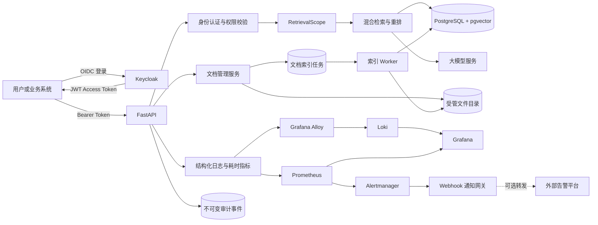

# Multi-tenant Long-context RAG Engine

[](https://github.com/Heresy0/Multi-tenant-long-context-rag-engine/actions/workflows/ci.yml)

面向企业内部知识库的多租户 RAG 问答系统。项目使用 Keycloak 完成 OIDC 身份认证，在 PostgreSQL 中维护租户、部门、用户、知识库和授权关系，并通过 pgvector 实现带强制权限范围的向量检索。

系统已经覆盖文档上传、幂等索引、混合检索、重排、答案生成、引用校验、结构化观测日志和离线评估等核心链路，重点解决企业知识库中“用户是谁、能够查询哪些资料、回答依据来自哪里”的问题。

## 核心能力

- Keycloak OIDC 登录、JWT 签名及 issuer、audience 校验
- 租户、部门、用户和知识库四层权限模型
- 用户授权与部门授权，支持 `viewer`、`editor` 和 `admin` 权限
- 不可变 `RetrievalScope`，检索时强制携带 `tenant_id` 和 `knowledge_base_id`
- PostgreSQL 16、pgvector 0.8.6 和余弦距离 HNSW 索引
- PDF、DOCX、TXT、Markdown 文档解析、切分和 1024 维向量入库
- 文件内容未变化时跳过重复入库，更新失败时保留旧版本
- 向量检索、BM25 关键词检索、融合和重排
- 可回答性判断、资料引用和拒答机制
- 文档列表、上传、更新及删除 API
- 租户级问答限流、并发限制及文档数量/存储配额
- 问答阶段耗时、请求 ID 和权限拒绝事件等结构化日志
- Loki 集中日志、Grafana 日志检索和跨服务请求关联
- 事务内审计事件、数据库级防篡改触发器和管理员查询 API
- Worker 心跳、索引队列状态和分层健康检查
- Prometheus 指标、Alertmanager 通知和自动配置的 Grafana 看板
- 开发集、独立测试集和答案级离线评估脚本
- Locust 稳定负载、治理压力场景和自动性能基线门禁
- Docker Compose 本地环境及 GitHub Actions 持续集成
- 同源浏览器工作台，支持企业登录、知识问答、文档管理及索引任务状态查看

演示与收尾验收步骤见 [演示验收指南](docs/DEMO.md)。项目当前面向功能演示和
技术方案验证，不将小样本评估结果或单机压测结果等同于生产级服务承诺。

## 系统架构



一条问答请求的大致流程为：

1. API 验证 Keycloak JWT，并把外部身份映射为本地租户用户。
2. 授权服务验证用户对目标知识库的访问权限。
3. 系统生成不可变的 `RetrievalScope`。
4. 检索仓储在数据库查询中强制过滤租户和知识库。
5. 系统完成向量与关键词混合检索、结果融合和重排。
6. 大模型根据受控上下文生成答案，系统校验并输出引用。

## 技术栈

| 类别 | 技术 |
| --- | --- |
| Web API | FastAPI、Pydantic、Uvicorn |
| 身份认证 | Keycloak、OIDC、JWT |
| 数据库 | PostgreSQL 16、SQLAlchemy、Alembic |
| 向量检索 | pgvector 0.8.6、HNSW |
| RAG | LangChain、BM25、DashScope Embedding/Rerank/LLM |
| 文档处理 | PyPDF、python-docx、docx2txt |
| 测试 | pytest、真实 PostgreSQL 集成测试 |
| 工程化 | Docker Compose、GitHub Actions |
| 可观测性 | JSON 日志、Grafana Alloy、Loki、Prometheus、Alertmanager、Grafana |

## 目录结构

```text
.
├── backend/app/              # FastAPI、认证授权、检索和问答服务
│   ├── api/                  # REST API 路由
│   ├── db/                   # ORM 模型、数据库会话及初始化逻辑
│   └── security/             # OIDC、Principal、权限与检索范围
├── migrations/               # Alembic 数据库迁移
├── scripts/                  # 租户初始化、批量入库和评估工具
├── tests/                    # 单元测试、API 测试和集成测试
├── evals/
│   ├── datasets/             # 开发集和独立测试集
│   └── reports/              # 评估报告
├── sample_docs/              # 演示文档
├── monitoring/               # Prometheus、Alertmanager、Alloy、Loki 与 Grafana 配置
├── compose.yaml              # 应用、依赖服务与监控栈
├── Dockerfile                # API 生产镜像入口
└── requirements.txt
```

## 快速开始

### 1. 环境要求

- Git
- Docker Desktop，支持 Docker Compose
- 可选：Python 3.12，用于不通过容器运行 API 和测试
- 可用的对话、Embedding 和 Rerank 模型服务

### 2. 获取代码

```powershell
git clone https://github.com/Heresy0/Multi-tenant-long-context-rag-engine.git
Set-Location Multi-tenant-long-context-rag-engine
```

### 3. 配置环境变量

```powershell
Copy-Item .env.example .env
```

编辑 `.env`，至少设置以下配置：

- PostgreSQL 数据库名、用户名和密码
- Keycloak 管理员用户名和密码
- OIDC issuer、audience 和 JWKS 地址
- DashScope 对话、Embedding 和 Rerank 模型配置
- DeepSeek 模型配置
- OSS 配置

应用启动时会校验必要环境变量，空值会导致启动失败。不要把包含真实密钥的 `.env` 提交到 Git。

### 4. 启动基础服务

首次运行时，先启动 PostgreSQL 和 Keycloak：

```powershell
docker compose up -d postgres keycloak
docker compose ps
```

访问 Keycloak 管理后台：

- 地址：<http://127.0.0.1:8080>
- 管理员账号：使用 `.env` 中的配置

在 Keycloak 中创建以下开发环境资源：

- Realm：`enterprise-knowledge`
- Client：`enterprise-knowledge-api`
- Client audience：`enterprise-knowledge-api`
- 测试用户，例如 Alice 和 Bob

本地用户通过 Keycloak Token 中的 `sub` 与数据库中的 `external_subject` 关联。

### 5. 启动 API 和索引 Worker

Keycloak Realm 和模型配置准备完成后，构建并启动全部服务：

```powershell
docker compose up --build -d
docker compose ps
```

检查服务：

```powershell
Invoke-RestMethod http://127.0.0.1:8000/health
```

正常响应：

```json
{
  "status": "ok"
}
```

常用地址：

- Swagger API 文档：<http://127.0.0.1:8000/docs>
- OpenAPI JSON：<http://127.0.0.1:8000/openapi.json>
- Keycloak：<http://127.0.0.1:8080>
- Prometheus：<http://127.0.0.1:9090>
- Alertmanager：<http://127.0.0.1:9093>
- 告警 Webhook 网关状态：<http://127.0.0.1:8090/status>
- Loki 就绪状态：<http://127.0.0.1:3100/ready>
- Alloy 组件状态：<http://127.0.0.1:12345>
- Grafana：<http://127.0.0.1:3000>

查看 API、索引 Worker 和告警通知日志：

```powershell
docker compose logs -f api worker alloy loki alertmanager alert-webhook
```

健康检查地址：

- `/health/live`：API 进程存活检查
- `/health/ready`：数据库就绪检查
- `/health/indexing`：Worker 心跳与索引队列状态

Worker 默认每 10 秒写入一次心跳，30 秒没有新心跳即视为不可用。
可以通过 `INDEXING_WORKER_HEARTBEAT_SECONDS` 和
`INDEXING_WORKER_STALE_SECONDS` 调整，但失联阈值至少应为心跳间隔的两倍。

### Prometheus、Loki、Alertmanager 与 Grafana

API 在 `/metrics` 导出 Prometheus 文本指标。指标标签只包含请求路由、
状态和处理结果等低基数字段，不包含租户、用户、问题、文档或任务标识。
租户上传配额拒绝通过
`enterprise_tenant_upload_quota_rejections_total{resource}` 统计，
`resource` 仅区分 `documents` 与 `storage_bytes`，不会产生高基数标签。

Prometheus 每 15 秒抓取一次 API，并加载以下告警：

- 索引 Worker 持续不可用
- 排队任务持续超过十个
- 最近十分钟出现最终失败任务
- QA P95 延迟持续超过十五秒

Prometheus 把触发的告警发送给 Alertmanager。Alertmanager 负责分组、
去重、抑制、重复通知和恢复通知，再发送到内部 Webhook 网关。严重告警
等待 5 秒后发送，每 30 分钟重复一次；普通告警等待 10 秒后发送，默认
每 4 小时重复一次。同名 `critical` 告警会抑制对应的 `warning` 告警。

Webhook 网关默认进入本地接收模式，只输出结构化事件和低基数指标，
不保存告警正文。需要转发到接受 Alertmanager JSON 的企业告警平台时，
先创建只供网关读取的独立环境文件：

```powershell
Copy-Item .env.alerting.example .env.alerting
```

然后在 `.env.alerting` 中配置：

```env
ALERT_WEBHOOK_FORWARD_URL=https://alerts.example.com/hooks/your-id
ALERT_WEBHOOK_AUTHORIZATION=Bearer your-token
ALERT_WEBHOOK_TIMEOUT_SECONDS=10
```

`ALERT_WEBHOOK_AUTHORIZATION` 是可选项。不要把真实 URL、令牌或密码提交
到 Git；它们只应保存在本地 `.env.alerting` 或部署平台的密钥管理服务中。外部
端点返回非 2xx 或连接失败时，网关返回 502，让 Alertmanager 自动重试。

Grafana 启动时会自动配置 Prometheus、Loki 两个数据源，以及
`Enterprise Knowledge RAG`、`Enterprise Knowledge Logs & Audit` 两个看板。
首次启动前应在 `.env` 中修改：

```env
GRAFANA_ADMIN_USER=admin
GRAFANA_ADMIN_PASSWORD=<强密码>
```

Alloy 通过只读 Docker Socket 发现本项目容器，把日志发送到 Loki。
Loki 在本地保留 7 天日志；`service`、`container`、`environment` 等低基数
字段作为标签，用户、租户、知识库和 `request_id` 不作为标签。需要按请求
排障时，在 Grafana Explore 中使用：

```logql
{stack="enterprise-knowledge", service="api"}
| json
| request_id="<响应头中的 X-Request-ID>"
```

查看已经成功提交到数据库的审计事件：

```logql
{stack="enterprise-knowledge", service="api"}
| json
| event="audit.committed"
```

Loki 本身不负责业务审计的永久保存。权威记录存放在 PostgreSQL
`audit_events` 表中；Loki 中的副本用于搜索、关联和排障。Loki 和 Alloy
端口仅绑定 `127.0.0.1`。生产环境应把 Loki 放在私有网络或认证代理后，
并使用受控的日志采集权限。

### 不可变审计日志

系统对以下安全敏感动作写入审计事件：

- 文档上传并创建异步索引任务
- 文档删除
- 最终失败索引任务的人工重试
- 问答访问成功、拒绝、参数无效或执行失败

上传、删除和重试的审计事件与业务变更使用同一数据库事务。ORM 事件监听器
阻止应用代码更新或删除审计记录，Alembic 迁移还会在 PostgreSQL 中创建
`BEFORE UPDATE OR DELETE` 触发器，防止绕过 ORM 的直接 SQL 篡改。

审计详情采用白名单式最小记录原则：只保存版本号、索引任务 ID、是否可回答、
引用数量等必要字段，不保存 JWT、问题、答案、文档正文、本地路径或存储 URI。
事件保留原始 `tenant_id`、`actor_user_id` 和资源 ID 快照，不使用指向业务表的
级联外键，因此删除业务资源后审计证据仍然存在。

常用指标包括：

```text
enterprise_http_requests_total
enterprise_qa_requests_total
enterprise_qa_request_duration_seconds
enterprise_qa_stage_duration_seconds
enterprise_indexing_jobs_total
enterprise_indexing_job_duration_seconds
enterprise_indexing_workers_active
enterprise_indexing_queue_jobs
enterprise_indexing_oldest_queued_seconds
enterprise_alert_webhook_deliveries_total
enterprise_alert_webhook_alerts_total
alertmanager_notifications_total
alertmanager_notifications_failed_total
```

API 指标由 `api:8000/metrics` 提供；索引执行计数和耗时由 Worker
内部的 `worker:9101/metrics` 提供。Worker 指标端口只暴露在 Compose
内部网络，不映射到宿主机。

Alertmanager 和 Webhook 网关分别监听 `9093` 和 `8090`。本地端口只绑定
到 `127.0.0.1`；生产部署时也应通过防火墙、反向代理或私有网络限制访问。

可以随时执行一次不会污染业务数据的通知链路冒烟测试：

```powershell
python scripts/test_alert_pipeline.py
```

脚本会向本地 Alertmanager 注入一条临时严重告警，等待网关接收后输出
`"status": "passed"`，并在退出前自动把该测试告警标记为已恢复。

停止服务：

```powershell
docker compose down
```

`docker compose down` 不会删除数据库和文档卷。只有明确需要清空本地数据时，才使用 `docker compose down --volumes`。

## 浏览器工作台

API 启动后打开 <http://127.0.0.1:8000/>，即可使用内置的“知序”工作台。
页面使用原生 HTML / CSS / JavaScript，由 FastAPI 同源提供，Docker 镜像自动包含
静态资源，无需 Node.js、前端构建或额外容器。`3000` 端口仍为 Grafana。

- 选择当前账号有权访问的知识库，提交问题并查看答案、引用和耗时。
- 查看文档的索引状态、版本、分块数量和更新时间。
- editor / admin 可上传和删除文档、查看索引任务、重试失败任务。
- 上传返回 202 后，页面每 5 秒刷新活动任务；任务完成后文档可用于问答。
- viewer 仅可查看和提问。所有权限仍由 API 校验，前端显示不替代服务端授权。

初次体验可点击“登录工作空间”，展开“已有访问令牌？临时登录”，粘贴现有
Alice / Bob Access Token。令牌仅保存在页面内存中，刷新后需要重新登录；过期时会
提示重新登录。问题和答案也只保留在当前页面，切换知识库或退出时清空。

使用企业账号直接登录前，需要在 Keycloak 的 `enterprise-knowledge` Realm
创建一个浏览器 public client：

1. Client ID：`enterprise-knowledge-web`（对应 `.env` 中可选的
   `OIDC_FRONTEND_CLIENT_ID`，默认使用此名称）。
2. Client authentication：Off；Standard flow：On；Implicit flow 和 Direct access grants：Off。
3. Valid redirect URIs：`http://127.0.0.1:8000/`。
4. Valid post logout redirect URIs：`http://127.0.0.1:8000/`。
5. Web origins：`http://127.0.0.1:8000`。
6. 当前 Keycloak 26.7.4 界面：Settings → Capability config → Require PKCE：On，
   PKCE Method：`S256`，保存客户端配置。其他版本可能使用不同字段名称。
7. Client scopes → `enterprise-knowledge-web-dedicated` → Mappers →
   Configure a new mapper（已有映射时从 Add mapper 菜单进入）→ Audience。
   Name 可填 `enterprise-api-audience`；Included Client Audience 必须从下拉列表
   **点击选中** `enterprise-knowledge-api`（与 `OIDC_AUDIENCE` 一致），
   Included Custom Audience 留空，Add to access token：On，Add to ID token：Off。
   保存后重新打开映射，确认 Audience 的值不是空白。

以上 public client、重定向与来源配置遵循
[Keycloak 浏览器应用说明](https://www.keycloak.org/securing-apps/javascript-adapter)。
前端使用授权码 + PKCE S256，不接收用户密码、不使用 client secret；Keycloak 返回
Token 后仍由原有 JWT 验证和数据库权限链路鉴权。浏览器登录支持自动续期，Token
仅在内存中保存，sessionStorage 只暂存一次性登录 state 和 PKCE verifier。
生产环境需将登录回调、登出回调、Web origins 和 `OIDC_ISSUER` 改为对应 HTTPS 地址。

若登录回到工作台后仍出现“访问令牌无效或已过期”，该提示也可能表示 audience、
issuer 或签名公钥校验失败，不一定是真的过期。优先核对上述 Audience 映射；修改
映射后必须刷新页面并重新登录以取得新令牌，不要关闭后端校验或粘贴令牌到公共网站。

更新 Docker 页面与 API：

```powershell
docker compose up -d --build api worker
```

本机 `--reload` 运行时刷新页面即可。前端接口及安全头测试可执行：

```powershell
python -m pytest tests/test_frontend_api.py -q
```

若本机已有 Node.js 24，可额外运行无依赖的登录逻辑测试（CI 也会执行）：

```powershell
node --test tests/frontend/auth.test.mjs
```

Node.js 仅用于开发测试；部署和运行工作台不需要安装 Node.js。

## 不使用容器运行 API

PostgreSQL 和 Keycloak 仍可通过 Docker 启动，API 在本机虚拟环境中运行：

```powershell
python -m venv .venv
Set-ExecutionPolicy -Scope Process Bypass
.\.venv\Scripts\Activate.ps1
python -m pip install --upgrade pip
python -m pip install -r requirements-dev.txt
python -m alembic upgrade head
python -m uvicorn backend.app.main:app --reload
```

本机运行时，`.env` 中的数据库和 Keycloak 地址应使用 `127.0.0.1`，而不是 Compose 服务名。

## 初始化租户与权限数据

先从 Keycloak 用户详情或访问令牌的 `sub` 字段取得用户 subject，然后执行初始化脚本。

创建首个租户、部门、管理员和知识库：

```powershell
python scripts/bootstrap_tenant.py `
  --tenant-name "示例企业" `
  --department-name "技术部" `
  --subject "<Alice 的 Keycloak sub>" `
  --user-name "Alice" `
  --user-email "alice@example.com"
```

为已有租户创建另一个部门负责人：

```powershell
python scripts/provision_department_manager.py `
  --tenant-name "示例企业" `
  --department-name "人力资源部" `
  --subject "<Bob 的 Keycloak sub>" `
  --user-name "Bob" `
  --user-email "bob@example.com"
```

脚本会输出租户、用户、部门和知识库 UUID，后续入库与接口验证会使用这些 ID。

如果 API 仅在容器中安装了依赖，也可以把命令改为：

```powershell
docker compose exec api python scripts/bootstrap_tenant.py --help
```

## 文档入库

系统支持 `.pdf`、`.docx`、`.txt` 和 `.md` 文件。

TXT 先清理 UTF-8 BOM、空字符与换行，按空行分段，识别明确的编号标题和
`Q1`、`Q:`、`问：` 问答对；长段落使用 500 字、50 字重叠的二次切分。
Markdown 按 `#` 标题和 Setext 标题建立章节路径，代码围栏内不识别标题；
代码块保留缩进与语言标记，超长代码按行切分并为每块补完整围栏。表格按行
切分并重复表头，列表条目与缩进说明尽量一起保留。TXT、Markdown 和 DOCX
复用最终分块生成逻辑，统一附加文档名、章节、内容类型和父单元标识。

当前切分版本为 `structured-v3`。版本升级不会自动重建已有索引，需要重新
提交入库任务；再次入库时版本检查会使旧版本分块重新生成。

PDF 入库采用渐进式处理：先清理重复页眉、页脚和页码，按标题与段落进行
跨页切分，并为分块保留章节和起止页码；检测到表格或多栏内容时使用布局
解析；页面只有图片而没有足够文本时自动使用 OCR。相关运行参数包括：

- `PDF_LAYOUT_ENABLED`：是否启用表格和多栏解析，默认启用。
- `PDF_OCR_ENABLED`：是否对图片页启用 OCR，默认启用。
- `PDF_OCR_LANGUAGE`：Tesseract 语言，默认 `chi_sim+eng`。
- `PDF_OCR_MIN_CHARACTERS`：低于该文本字符数时考虑 OCR，默认 `20`。
- `POPPLER_PATH`、`TESSERACT_CMD`：非标准安装位置下的可执行文件路径。

OCR 只会用于低文本量且包含图片的页面，普通文本型 PDF 不承担 OCR 开销。

### 通过 API 上传

取得访问令牌后，可以在 Swagger 页面点击 **Authorize**，然后调用：

```text
POST /api/knowledge-bases/{knowledge_base_id}/documents
```

上传操作要求当前用户至少具有目标知识库的 `editor` 权限。
接口完成安全暂存和任务创建后返回 `202 Accepted`，响应中的
`indexing_job.id` 是后续查询索引进度的任务标识。文件在任务成功前
不会覆盖已有的正式版本。

每个租户默认最多保存 1000 个文档、占用 10 GiB 文档空间。配额以
PostgreSQL 为权威账本，同时计算正式文档和仍在排队、执行或失败保留期内的
候选文件。上传事务会锁定租户记录，因此多个 API 实例同时接收上传也不会
超卖额度。超额请求返回 `409 Conflict`，并通过
`X-Tenant-Quota-Resource`、`X-Tenant-Quota-Limit` 和
`X-Tenant-Quota-Used` 响应头说明触发的限制。

可以直接为不同租户配置不同额度，例如：

```sql
UPDATE tenants
SET max_document_count = 2000,
    max_storage_bytes = 21474836480
WHERE id = '<tenant UUID>';
```

索引成功后，候选文件预留会转换为正式文档占用；最终失败的候选文件在保留期
内仍占用额度，Worker 清理过期候选文件后自动释放。删除文档时，相关正式占用
和任务预留随数据库级联删除自动释放。历史命令行入库文档可再次运行相同入库
命令，以幂等方式回填 `file_size_bytes`，不会重复生成向量。

索引任务由独立 Worker 执行。可以使用以下接口查询任务状态：

```text
GET /api/knowledge-bases/{knowledge_base_id}/indexing-jobs/{job_id}
```

任务状态依次为 `queued`、`running`，最终进入 `succeeded` 或
`failed`。临时失败会按照任务的最大尝试次数自动重试。
编辑者还可以查询知识库最近的任务，并按状态或文档过滤：

```text
GET /api/knowledge-bases/{knowledge_base_id}/indexing-jobs
GET /api/knowledge-bases/{knowledge_base_id}/indexing-jobs?status=failed
```

最终失败任务的候选文件默认保留 24 小时。在保留期内排除故障后，
可以通过以下接口把任务重新加入队列：

```text
POST /api/knowledge-bases/{knowledge_base_id}/indexing-jobs/{job_id}/retry
```

保留时间由 `INDEXING_FAILED_FILE_RETENTION_HOURS` 控制。超过保留期的
候选文件会由 Worker 清理，此后需要重新上传原文档。

### 通过命令行写入单个文件

```powershell
python scripts/index_pgvector.py `
  --file "sample_docs/example.docx" `
  --tenant-id "<tenant UUID>" `
  --knowledge-base-id "<knowledge base UUID>" `
  --user-id "<user UUID>"
```

### 批量写入目录

```powershell
python scripts/index_pgvector.py `
  --directory "sample_docs" `
  --recursive `
  --tenant-id "<tenant UUID>" `
  --knowledge-base-id "<knowledge base UUID>" `
  --user-id "<user UUID>"
```

入库服务会校验 1024 维向量，使用事务替换旧分块，并根据内容和索引配置判断是否跳过重复入库。

## API 概览

所有 `/api` 接口都需要：

```http
Authorization: Bearer <access_token>
```

| 方法 | 路径 | 最低权限 | 说明 |
| --- | --- | --- | --- |
| `GET` | `/health` | 无 | 健康检查 |
| `GET` | `/health/live` | 无 | API 进程存活检查 |
| `GET` | `/health/ready` | 无 | 数据库就绪检查 |
| `GET` | `/health/indexing` | 无 | Worker 心跳和索引队列状态 |
| `GET` | `/metrics` | 无 | Prometheus 指标，仅建议在内网暴露 |
| `GET` | `/api/knowledge-bases` | 已登录 | 列出当前用户可访问的知识库 |
| `GET` | `/api/knowledge-bases/{knowledge_base_id}/documents` | viewer | 列出知识库文档 |
| `POST` | `/api/knowledge-bases/{knowledge_base_id}/documents` | editor | 暂存文档并创建异步索引任务 |
| `GET` | `/api/knowledge-bases/{knowledge_base_id}/indexing-jobs` | editor | 列出并过滤文档索引任务 |
| `GET` | `/api/knowledge-bases/{knowledge_base_id}/indexing-jobs/{job_id}` | editor | 查询文档索引任务状态 |
| `POST` | `/api/knowledge-bases/{knowledge_base_id}/indexing-jobs/{job_id}/retry` | editor | 人工重试最终失败任务 |
| `DELETE` | `/api/knowledge-bases/{knowledge_base_id}/documents/{document_id}` | editor | 删除文档、分块和受管文件 |
| `GET` | `/api/knowledge-bases/{knowledge_base_id}/audit-events` | admin | 查询租户隔离的知识库审计事件 |
| `POST` | `/api/qa` | viewer | 在指定知识库范围内问答 |

问答请求示例：

```json
{
  "knowledge_base_id": "8e4af664-22c1-480e-9393-36ac401da0f5",
  "question": "开放平台访问令牌默认有效期是多少？"
}
```

成功响应包含答案、是否可回答、引用、拒答原因和各处理阶段耗时。响应头中的 `X-Request-ID` 可用于关联服务端结构化日志和审计事件。

审计查询支持 `action`、`outcome`、`before` 和 `limit` 参数。接口同时强制
校验当前租户、知识库和 `admin` 权限，普通 `viewer`、`editor` 不能读取。

## 测试

运行单元测试和 API 测试：

```powershell
python -m pytest -q
```

运行真实 PostgreSQL 与 pgvector 集成测试：

```powershell
$env:RUN_POSTGRES_INTEGRATION_TESTS = "1"
python -m pytest tests/test_pgvector_integration.py -q
Remove-Item Env:RUN_POSTGRES_INTEGRATION_TESTS
```

运行编译检查：

```powershell
python -m compileall backend scripts
```

GitHub Actions 会在 Pull Request 和 `main` 分支推送时自动执行：

1. 启动真实 pgvector PostgreSQL 服务。
2. 安装开发依赖。
3. 编译 Python 源码。
4. 执行 Alembic 数据库迁移。
5. 运行完整 pytest 测试。
6. 构建 API Docker 镜像。

## 性能压测与容量基线

项目提供 [Locust 场景](tests/load/locustfile.py) 和自动报告脚本，直接访问正式
OIDC、权限、限流、并发控制和 QA 链路。支持两种模式：

- `steady`：建立正常负载下的吞吐量、P50、P95、P99、错误率基线；429 算失败。
- `governance`：刻意超过租户并发上限；429 算预期结果，5xx 仍然算失败。

原始 Locust CSV 和 HTML 写入 `data/load-tests`，不会提交到 Git。汇总脚本会
生成不包含 JWT、问题正文或租户标识的 JSON 报告，并检查最小请求数、失败率、
P95、5xx 数量以及治理场景是否真的出现 429。任一门槛不通过时脚本返回非零
退出码，可直接用作持续集成或发布门禁。

完整准备步骤、PowerShell 命令和推荐参数见
[tests/load/README.md](tests/load/README.md)。

## 答案级评估

评估脚本通过受保护的 `/api/qa` 接口运行，因此需要有效的 JWT：

```powershell
$env:ENTERPRISE_KB_ACCESS_TOKEN = "<JWT>"

python scripts/evaluate_answers.py `
  --dataset evals/datasets/answer_test.jsonl `
  --knowledge-base-id "<knowledge base UUID>" `
  --category technical `
  --output evals/reports/answer_test_technical.json

Remove-Item Env:ENTERPRISE_KB_ACCESS_TOKEN
```

评估报告包含：

- 可回答性准确率和混淆矩阵
- 可回答问题接受率
- 不可回答问题拒答率与误接受率
- 必要事实覆盖率与事实完整率
- 引用来源准确率、召回率和命中率
- 总耗时及检索、重排、生成等阶段的 P50/P95 耗时

当前独立技术测试集包含 11 条样本。已有报告中，可回答性准确率为 100%，必要事实覆盖率为 92.86%，引用来源准确率和召回率均为 100%。该结果用于回归比较，不代表大规模生产流量下的最终效果。

## 权限与数据隔离

权限隔离不是只在 API 路由中完成。核心检索仓储要求调用方提供不可变的 `RetrievalScope`，数据库查询同时使用：

- `tenant_id`
- `knowledge_base_id`

因此，即使上层误传文档 ID，底层检索也不会跨租户或跨知识库返回数据。现有测试覆盖 Alice、Bob 分属不同部门时的知识库访问隔离，以及跨知识库向量检索隔离。

## 文档生命周期

- 同一知识库中的同名文件再次上传时视为更新。
- 文件内容和索引配置未变化时跳过重复入库。
- 更新成功后文档版本号递增。
- 更新过程使用事务替换分块；向量生成或写入失败时保留旧版本。
- 删除接口同时清理数据库文档记录、向量分块和受管文件。
- 删除服务只允许删除受管文档目录中的文件，不会删除原始样例文件。

## 当前项目边界

项目目前适合本地开发、功能演示和技术方案验证，距离生产环境还需要继续补充：

- 将当前数据库任务队列扩展为可水平扩容的多 Worker 队列
- 生产级对象存储和文件病毒扫描
- Keycloak Realm 自动化配置和密钥管理
- OpenTelemetry 分布式追踪和跨服务 Trace 上下文
- 上传频率控制和可视化审计管理后台
- 数据库备份、恢复演练和滚动迁移策略
- 大规模文档下的关键词索引优化和多节点容量测试
- 前端会话持久化、知识库管理后台与更多交互功能

## 开发流程

建议每个阶段使用独立分支：

```powershell
git switch main
git pull origin main
git switch -c codex/<feature-name>
```

提交 Pull Request 前至少执行：

```powershell
python -m compileall backend scripts
python -m pytest -q
git diff --check
```

## License

当前仓库尚未声明开源许可证。如需公开复用或接受外部贡献，请先增加明确的 `LICENSE` 文件。
